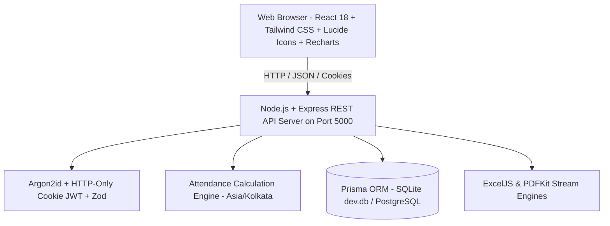

# SAISHNAA SMART EMPLOYEE ATTENDANCE MANAGEMENT SYSTEM
### Saishnaa Software Solutions Private Limited

A comprehensive, production-ready, full-stack enterprise web portal designed for real-time employee attendance tracking, shift scheduling, automated payroll calculations, leave management, and audit-grade compliance reporting.

---

## 🚀 Live Local Deployment

| Service | URL | Status |
| :--- | :--- | :--- |
| **Frontend Web Portal** | [http://localhost:5173](http://localhost:5173) | 🟢 **RUNNING** |
| **Backend REST API** | [http://localhost:5000](http://localhost:5000) | 🟢 **RUNNING** |
| **API Health Check** | [http://localhost:5000/api/health](http://localhost:5000/api/health) | 🟢 **HEALTHY** |

---

## 🔑 Pre-Seeded Demo Credentials

All test accounts are pre-configured with active status, assigned departments, shifts, and leave balances:

| Role | Employee ID | Email | Password |
| :--- | :--- | :--- | :--- |
| **System Administrator** | `EMP001` | `admin@saishnaa.com` | `Admin@Saishnaa2026!` |
| **HR Manager** | `EMP002` | `hr@saishnaa.com` | `Hr@Saishnaa2026!` |
<!-- | **Senior Engineer** | `EMP003` | `rajesh.k@saishnaa.com` | `Emp@Saishnaa2026!` | -->
| **QA Engineer** | `EMP004` | `ananya.r@saishnaa.com` | `Emp@Saishnaa2026!` |
| **DevOps Engineer** | `EMP005` | `vikram.s@saishnaa.com` | `Emp@Saishnaa2026!` |

> **Note**: Users can sign in using **either** their corporate email address or their sequential Employee ID (e.g. `EMP001`).

---

## 🏛️ System Architecture



### Technology Stack
- **Frontend**: React 18, Vite 6, Tailwind CSS 3, Lucide React icons, Recharts for data analytics, Axios for HTTP client, Day.js with timezone plugin.
- **Backend**: Node.js 22+, Express 4, Prisma ORM 6, Argon2id password hashing, JSON Web Tokens (stored in HTTP-only, SameSite cookies), Zod input validation, Helmet, CORS.
- **Database**: Prisma ORM with dual-database support: zero-friction local SQLite (`dev.db`) for immediate offline execution, with full PostgreSQL schema portability for cloud deployment.
- **Export Engines**: ExcelJS (styled multi-column workbooks with company headers and formula totals) and PDFKit (vector landscape branded PDF reports).

---

## 🌟 Key Features

### 1. Attendance Calculation Engine
- **Server-Side Truth**: All timestamps generated in `Asia/Kolkata` (IST) on the backend; client clocks cannot manipulate attendance.
- **Shift Punctuality**: Automated comparison of check-in time against scheduled shift start and configurable grace periods (e.g., 15 minutes).
- **Session State Machine**: Seamless progression: `NOT_CHECKED_IN` ➔ `WORKING` ⇄ `ON_BREAK` ➔ `CHECKED_OUT`.
- **Break Deductions**: Multiple breaks per day tracked with start/end timestamps. Total break minutes automatically deducted from gross elapsed time.
- **Overnight Shifts**: Full support for shifts spanning across midnight (e.g., 21:00 to 05:00 next day).
- **Threshold Classifications**: Automatic calculation of `PRESENT`, `LATE`, `HALF_DAY`, `OVERTIME`, and `EARLY_DEPARTURE`.

### 2. Admin & HR Command Center
- **8 Live KPI Summary Cards**:
  1. Total Employees
  2. Active Employees
  3. Currently Working
  4. On Break
  5. Not Yet Checked In
  6. On Approved Leave
  7. Late Arrivals Today
  8. Pending Corrections
- **Interactive Visualizations**: Daily status doughnut charts, department attendance breakdown bars, and 7-day historical attendance trends.
- **Live Roster Table**: Real-time tabular view with instant search, department filters, and live working timers.

### 3. Employee Self-Service Portal
- **Dashboard Action Card**: One-click Check In, Start Break, End Break, and Check Out with dynamic state validation.
- **Live Elapsed Timer**: Running digital counter reflecting net working hours minus breaks.
- **Leave Balances**: Real-time display of Paid Leave, Casual Leave, Sick Leave, and Maternity/Paternity balances.
- **Attendance Calendar**: Visual monthly matrix highlighting presence, late arrivals, half-days, and leaves.
- **Regularization / Correction Requests**: Self-service submission with mandatory reason justification and immutable audit logging upon HR review.

### 4. Enterprise Reporting & Exports
- **10 Report Types**:
  - Daily Attendance Register
  - Monthly Payroll Summary (Total Days, Present Days, Late Days, Overtime Hours, Payable Days)
  - Late Arrivals & Grace Period Violations
  - Overtime Hours Audit
  - Departmental Attendance Analysis
  - Employee Master Attendance Card
  - Leave Utilization & Balances
  - Absenteeism Report
  - Shift Adherence & Deviations
  - System Audit Log
- **Direct Downloads**: One-click download as beautifully formatted **Excel (.xlsx)** or **PDF (.pdf)** directly in the browser.

---

## 🛠️ Developer Setup & Commands

### Running Locally

```bash
# 1. Start the Backend API Server (from backend directory)
cd backend
npm install
npm run start        # Or 'npm run dev' for file watching

# 2. Start the Frontend Dev Server (from frontend directory)
cd ../frontend
npm install
npm run dev
```

### Running Automated Test Suites

```bash
cd backend
npm test
```
**Test Results**: 15 unit and integration tests verifying calculation engine punctuality, grace periods, half-days, overnight shifts, Argon2id security, JWT claims, sequential employee code generation, and Excel/PDF generation.

---

## 🏢 Corporate Entity Information

- **Company**: SAISHNAA SOFTWARE SOLUTIONS PRIVATE LIMITED
- **System**: Smart Employee Attendance Management System
- **Timezone**: `Asia/Kolkata` (IST, UTC+05:30)
- **Deployment Ready**: Local Antigravity IDE / VS Code & Cloud-Ready (Docker / AWS / Azure / GCP)
